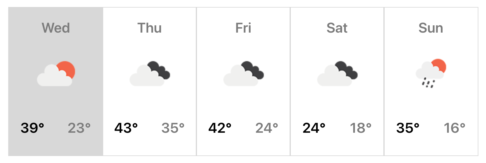

# Basic 5-Day Weather Forecast App

This app was created by [Jonayah M. Jackson](https://www.linkedin.com/in/jonayahmjackson/).

## `How This App Works`

This weather forecast app has important features that you should be aware of:

### `Geolocation`

This app uses the built-in JavaScript Geolocation API to find the user's latitude and longitude based on their IP address.  If you have your location turned off, a prompt will appear to give access to the application.  If you decline, the application will not work.

### `Open Weather Map API`

To get the forecast data, I used the [Open Weather Map API](https://openweathermap.org/api).  I chose to use the One Call API to get daily weather data that would update throughout the day.  

### `Forecast: The Cards`

Each card represents one of the upcoming 5 days.  The first card, or the grey card, is the current day and forecast.  Each card thereafter is for the following 4 days in the 5-day forecast.

The icon below the day name is the corresponding icon from the Open Weather Map API for that particular day's forecast.  The name of the icon is also the alt description for visually-impaired users.

Below the icon are two temperature readings set in Fahrenheit.  The first temperature is the maximum for the day, and the second one is the minmum for the day.

## `Questions?`

Reach out to `Jo` at [jonayah@thinkhalcyon.com](mailto:jonayah@thinkhalcyon.com).